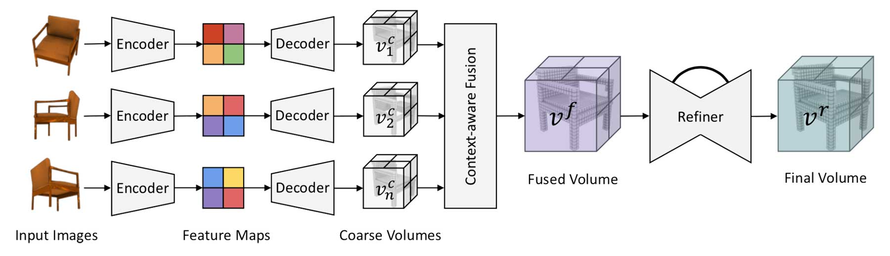
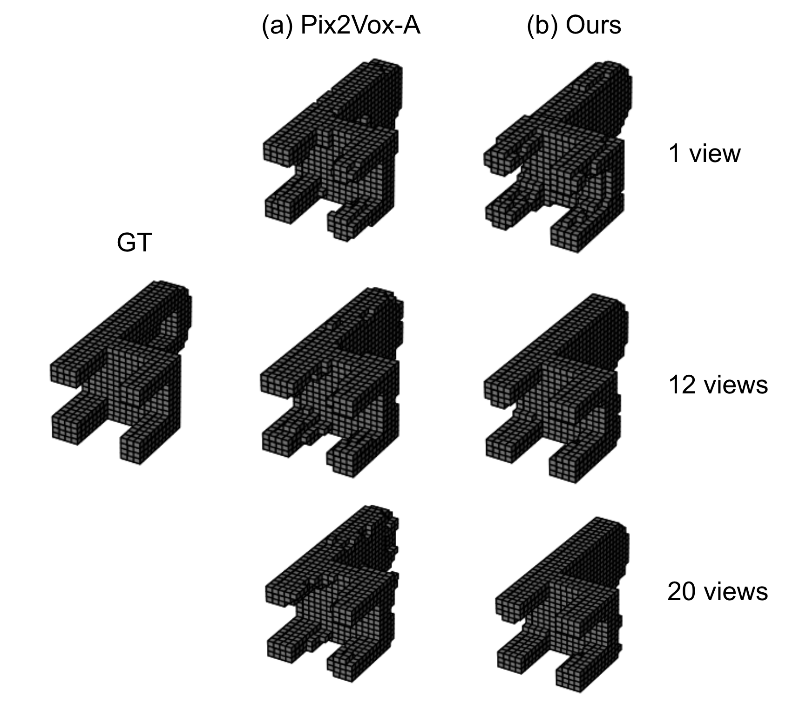

# Pix2Vox-ResNet

This project is part of the course "Machine Learning for 3D Geometry" from Technical University of Munich, offered in Summer Semester 2022.

(source: https://github.com/hzxie/Pix2Vox)

This project is largely based on previous work from Pix2Vox (Xie et al. 2019).
Pix2Vox is an encoder-decoder-based framework for single-view or multi-view 3D shape reconstruction. 
It utilizes a pre-trained VGG-16 as part of its encoder to extract visual representations from the input images. 
In our project, we conduct an ablation study on Pix2Vox’s encoder by replacing the pre-trained VGG-16 with a pre-trained ResNet-152, which has been shown to gain higher accuracy on the ImageNet benchmark. 
Our aim is to verify whether learned 2D features from pre-trained models with better accuracy on ImageNet can be used to generate 3D shape reconstructions of better quality. Experimental results on the ShapeNet benchmark indicate that the model using ResNet-152 gains an absolute IoU increase of 0.3% when using more than 12 views, while underperforming the model using VGG-16 when a small amount of views is used.

# Teams

- Cuong Nguyen
- Michelle Espranita Liman
- Thang Tran
- Viet Nguyen

# Test Results

## Single View Reconstruction

| Category   | 3D-R2N2               | Pix2Vox-F | Pix2Vox-A      | **Ours**             |
|------------|-----------------------|-----------|----------------|----------------------|
| airplane   | 0.513                 | 0.600     | **0.684**      | 0.624                |
| bench      | 0.421                 | 0.538     | **0.616**      | 0.541                |
| cabinet    | 0.716                 | 0.765     | **0.792**      | 0.762                |
| car        | 0.798                 | 0.837     | **0.854**      | 0.833                |
| chair      | 0.466                 | 0.535     | **0.567**      | 0.532                |
| display    | 0.468                 | 0.511     | **0.537**      | 0.502                |
| lamp       | 0.381                 | 0.435     | **0.443**      | 0.432                |
| speaker    | 0.662                 | 0.707     | **0.714**      | 0.691                |
| rifle      | 0.544                 | 0.598     | **0.615**      | 0.571                |
| sofa       | 0.628                 | 0.687     | **0.709**      | 0.684                |
| table      | 0.513                 | 0.587     | **0.601**      | 0.575                |
| telephone  | 0.661                 | 0.770     | **0.776**      | 0.740                |
| watercraft | 0.513                 | 0.582     | **0.594**      | 0.563                |
| Overall    | 0.560                 | 0.634     | **0.661**      | 0.628                |

- Single-view reconstruction on ShapeNet compared using Intersection-over-Union (IoU). The best number for each category is highlighted in bold. Ours is Pix2Vox-A with pre-trained ResNet152 encoders.

## Multiview Reconstruction

| Method                 | 1 view       | 2 views        | 3 views        | 4 views        | 5 views        | 8 views        | 12 views       | 16 views       | 20 views       |
|------------------------|--------------|----------------|----------------|----------------|----------------|----------------|----------------|----------------|----------------|
| 3D-R2N2                | 0.560        | 0.603          | 0.617          | 0.625          | 0.634          | 0.635          | 0.636          | 0.636          | 0.636          |
| Pix2Vox-F              | 0.634        | 0.660          | 0.668          | 0.673          | 0.676          | 0.680          | 0.682          | 0.684          | 0.684          |
| Pix2Vox-A              | **0.661**    | **0.686**      | **0.693**      | **0.697**      | **0.699**      | **0.702**      | 0.704          | 0.705          | 0.706          |
| **Ours**               | 0.628        | 0.669          | 0.683          | 0.690          | 0.695          | **0.702**      | **0.706**      | **0.708**      | **0.709**      |

- Multi-view reconstruction on ShapeNet compared using Intersection-over-Union (IoU). The best results for different numbers of views are highlighted in bold. Ours is Pix2Vox-A with pre-trained ResNet-152 encoders.

## Rendered Reconstruction

- Reconstruction results of Pix2Vox-A and our method on the ShapeNet test set using 1 view, 12 views, and 20 views. GT represents the ground truth of the 3D object. We observe that our method produces a better reconstruction using 20 views, but performs worse using 1 view.

